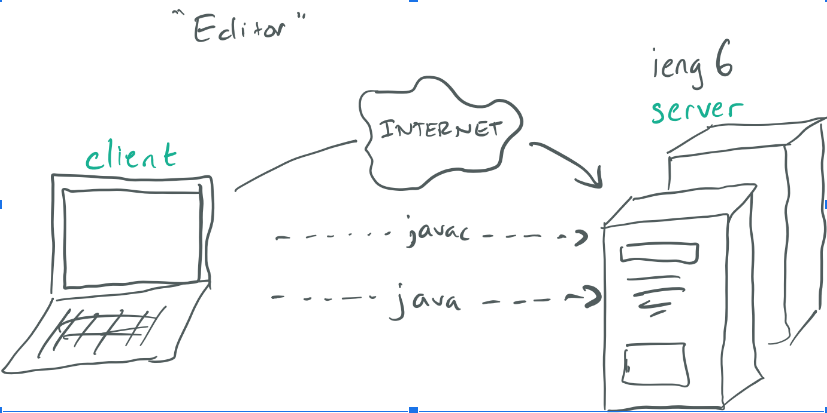

# Lab #1: Remote Access and the Filesystem

## Installing Visual Studio Code

Visual Studio Code (VS Code) is an interactive developement editor (IDE) useful for writing code, debugging, and a lot more. Here are the following steps to download Visual Studio Code:

* Click on [this](https://code.visualstudio.com/) website and download the installer for whatever operating system you are on. 

* Save and run the installer application. Unless you know what you are doing, just stick with installing the default options.

* Open up VS Code application and you should see the following: 


## Remotely Connecting
In the basement of University of California San Diego (UCSD), there are rows of large, powerful computers. This is called a server, which can be accessed remotely via a client, such as your computer. 



We can connect to these super-computers with a stable internet connection and VS Code. Here's how:

* The first step is to ensure you have OpenSSH installed. Visit this [link](https://docs.microsoft.com/en-us/windows-server/administration/openssh/openssh_install_firstuse) and follow the directions listed on the webiste.

* Lookup your [UCSD accont](https://sdacs.ucsd.edu/~icc/index.php) and see which additional ETS accound is associated with your Student ID. For this class, my account is cs15lwi22akf.

* In VS Code, open up a new terminal and type in the following command: `$ ssh cs15lwi22akf@ieng6.ucsd.edu`.

* It is perfectly normal to receive the following message:

`The authenticity of host 'ieng6.ucsd.edu (128.54.70.227)' can't be established.
RSA key fingerprint is SHA256:ksruYwhnYH+sySHnHAtLUHngrPEyZTDl/1x99wUQcec.
Are you sure you want to continue connecting (yes/no/[fingerprint])? `

* Type yes and give your password. Afterwards, you should see the following: 

```
Last login: Sun Jan  2 14:03:05 2022 from 107-217-10-235.lightspeed.sndgca.sbcglobal.net
quota: No filesystem specified.
Hello cs15lwi22akf, you are currently logged into ieng6-203.ucsd.edu

You are using 0% CPU on this system

Cluster Status 
Hostname     Time    #Users  Load  Averages  
ieng6-201   23:25:01   0  0.08,  0.17,  0.11
ieng6-202   23:25:01   1  0.09,  0.15,  0.11
ieng6-203   23:25:01   1  0.08,  0.15,  0.11

Sun Jan 02, 2022 11:28pm - Prepping cs15lwiakf
```

**Congrats!** Your terminal is now remotely connected to the servers in the CSE basement and any commands you run will now run on that computer. 

## Trying Some Commands
Here is a list of some basic commands the class used in Unix. 

* **CD:** used to change the directory.
* **ls:** used to list the contents inside a directory.
* **ls -a:** used to list all contents inside a directly, including hidden files.
* **mkdir new_folder:** used to create a new folder called new_folder in the directory you are currently in.
* **pwd:** used to return the current directory you are in. Here's an image to illustrate that.


## Moving Files with Secure Coppy (SCP)
Coping files from your personal computer to a remote computer is possible with the help of the SCP command. 
* Identify the file you would like to copy from your comuter to the remote computer. For this example, we'll use WehereAmI.java as the file we are copying. 
* Run the following command: `scp WehereAmI.java cs15lwi22akf@ieng6.ucsd.edu:~/` and type your password.

**Perfect!** You should have copied className.java into your account on the remote servers. In order to verify this, follow these steps.
* Login into ieng6 with ssh.
* Type `ls` and you should be able to see the file you copied. 


## Setting up an SSH Key
Everytime we log into the remote servers, we have to type out our long password. This can be cumbersome if we have to consistenly switch from our client and remote servers. In order to make the process more efficient, we can set up an SSH key to login without the need of a password. We can then copy the public key to a particular location on the server, and the private key in a particular location on the client.

* Type in `ssh-keygen` into the terminal. This command creates a pair of files called the public key and private key. 
* When the terminal asks for which file to save the key AND password, simply press enter to use the default one. The entireinteraction should look like this.

* When we type `ls .ssh`, we can verify that the private key is stored in .ssh in your comuter. 
* Now we need to copy the public key into your remote server account. To do so, login to your account
* Type `mkdir .ssh` and log out.
* On your client, type `scp /Users/victo/.ssh/id_rsa.pub cs15lwi22akf@ieng6.ucsd.edu:~/.ssh/authorized_keys`
* Finally, once you put in your password, you successfully copied your public key over to your server account. From this point onwards, you do not need to type in your password to login.

## Optimizing Remote Running
In order to optimize remotely running files between the client and the server using VS Code, there are small details we can employ. First of which, we can write multiple commands on the same line using semicolons.

* For example, type the following command into the terminal: `cp WhereAmI.java OtherMain.java; javac OtherMain.java; java WhereAmI`


You can also write a command in quotes at the end of an `ssh` command to run it directly on the remote server. 
* For example, we can write `$ ssh cs15lwi22@ieng6.ucsd.edu "ls"`.

In order to effectively make an local edit and then copying it to the remote server and running it, I suggest having this command saved on a separate document so you wouldn't spend time typing it all out. 
* `scp WhereAmI.java cs15lwi22akf@ieng6.ucsd.edu:~/; ssh cs15lwi22akf@ieng6.ucsd.edu "ls"; javac WhereAmI.java; java WhereAmI`

After putting the finishing touches on your local edit, we can simply copy and paste the command into our terminal by pressing using our mouse to highlight the command. Then press `ctr+c` and then click on the terminal and press `ctr+v`. Because we already established a key so that we can login without typing in our password, we do not need to use any more commands for copying. The `;` allows us to run multiple commands on the same line. The `ls` is our command to verify that the copy of our file has been successful. 

Here's a snapshot of what the terminal should look like. 


As you can see, we were able to copy a file to the server and run the code in 4 key strokes. Now that's efficiency if I've ever seen it!