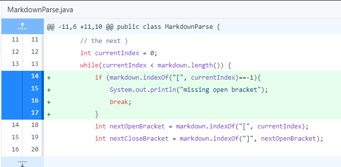

# Lab #2: Incremental Programming and Debugging

## Code Change #1

Here is the [test file](./something2.md) that caused the failure-inducing input that prompted me to make a change in the code. 

This picuture is the symptom:

The output runs an infinite loop, constantly printing out -1. 

In summary, the bug is caused because the test file was missing an open parenthesis for the link. Because it was missing, -1 was assigned to the openParen value and causes a cascading effect or wrong values. We see an infinite loop because the while loop condition is never met, which is caused by the cascading of wrong values.

## Code Change #2

Here is the [test file](./something3.md) that caused the failure-inducing input that prompted me to make a change in the code. 

This picuture is the symptom:

The output runs an infinite loop, constantly printing out 29. 

In summary, we see that the symptom is an infinite loop printing out 29. This is caused because we are missing an open bracket in our test file. The two correlates because the ending condition for the while loop is not met and is dependent on the correct value assigned to the variable nextopenBracket. Simialar to the previous example, because this value is wrong, it leads to a cascading effect of incorrect values for future variables.

## Code Change #3

Here is the [test file](./something4.md) that caused the failure-inducing input that prompted me to make a change in the code. 

This picuture is the symptom:

The output runs an infinite loop, constantly printing out 11. 

In summary, we see that the symptom is an infinite loop printing out 11. The value is correct, because the index at 11 is an open parenthesis. However, the infinite loop is caused by having an extra space in our input file. The two correlates because the ending condition for the while loop is not met and is dependent on the correct value assigned to all the variables, which will be off by one with the extra space. Simialar to the previous example, because this value is wrong, it leads to a cascading effect of incorrect values for future variables.