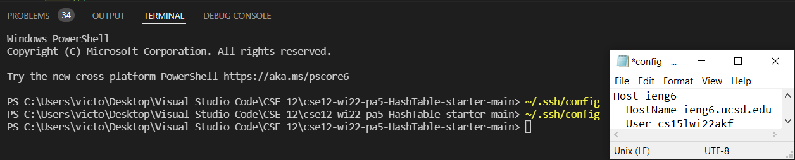
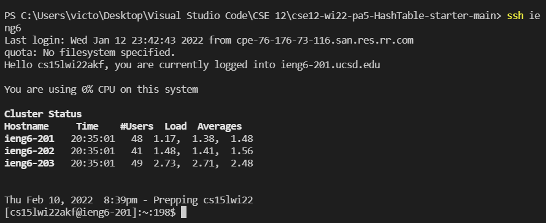
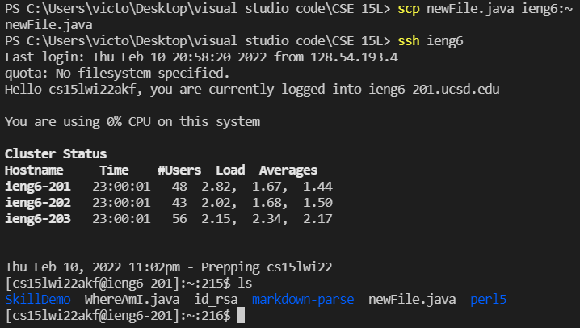

# Lab #3: Streamlining ssh Configuration

When logging into ieng6 from your personal computer, typically you would have to type in the terminal `ssh cs15lwi22zzz@ieng6.cusd.edu`, which can be tedious after a while. In order to reduce the amount of typing, we can simply type in `ssh ieng6` once we set up some configuration files.

1) Type in the following command into the terminal: `~/.ssh/config`. Write yes and just click enter when prompted a password. 
2) Step 1 should prompt a medium to open code up. Select nodepad and ensure that  the text matches with the following: 
```
Host ieng6
    HostName ieng6.ucsd.edu
    User cs15lwi22zzz (use your username)
```



Awesome! Now you should be able to log into ieng6 without needing to type in your password.



Finally, you can use `scp *file name* ieng6` to copy over items from your personal workspace onto ieng6 without needing to type in the full email and password
