# Lab #4: Debuggers

Here's the link to the markdown-parse repository that I created: https://github.com/vickykuwu/markdown-parse.git

Here's the link to the markdown-parse repository that I reviewed in class: https://github.com/maotcha/markdown-parse

The **first** test that we are doing for both versions of markdown-parse has the following test in code form, what it should look like in VS Code preview, and the test written: 

```
`[a link`](url.com)

[another link](`google.com)`

[`cod[e`](google.com)

[`code]`](ucsd.edu)
```

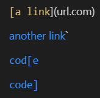
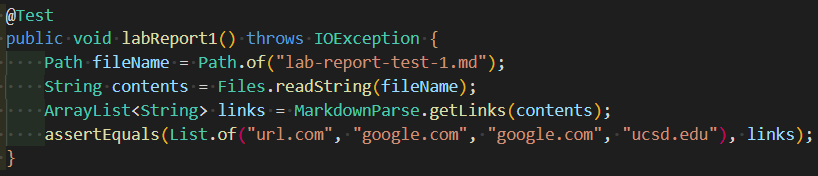
For my implementation, the test did not pass. Here is what the JUnit output shows for the test failure:
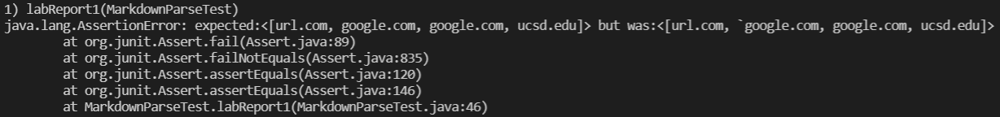
For motcha's implementation, we saw that the test did pass! 


The **second** test that we are doing for both versions of markdown-parse has the following test and what it should look like in VS Code preview:

```
[a [nested link](a.com)](b.com)

[a nested parenthesized url](a.com(()))

[some escaped \[ brackets \]](example.com)
```

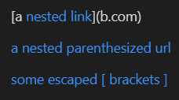
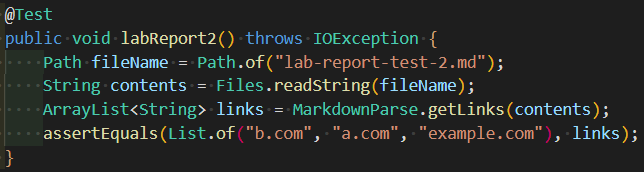
For my implementation, the test did not pass. Here is what the JUnit output shows for the test failure:
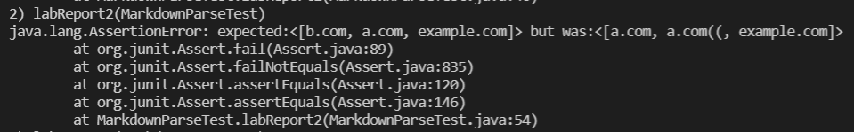
For motcha's implementation, we saw that the test did not pass. This is what the JUnit output shows for the test failure:
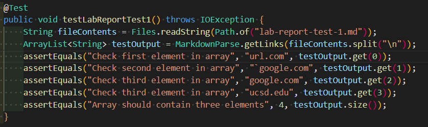

The **third** test that we are doing for both versions of markdown-parse has the following test and what it should look like in VS Code preview:

```
[this title text is really long and takes up more than 
one line

and has some line breaks](
    https://www.twitter.com
)

[this title text is really long and takes up more than 
one line](
    https://ucsd-cse15l-w22.github.io/
)


[this link doesn't have a closing parenthesis](github.com

And there's still some more text after that.

[this link doesn't have a closing parenthesis for a while](https://cse.ucsd.edu/


)

And then there's more text
```

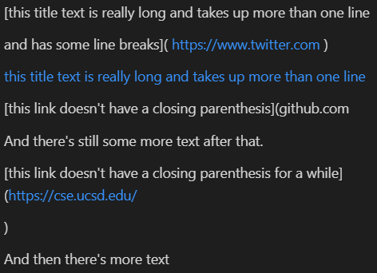
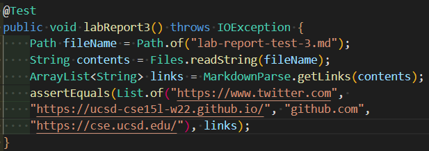
For my implementation, the test did not pass. Here is what the JUnit output shows for the test failure:
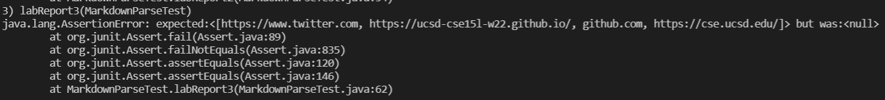
For motcha's implementation, we saw that the test did not pass. This is what the JUnit output shows for the test failure:
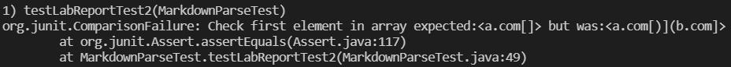

For snippet 1, I think my program requires a small code change so that any cases that use inline code with backticks should work. I believe I should implement code so that the algorithm only tracks the very first and very last parenthesis and bracket and group all characters in between to be the text that's written or be the link. 

For snippet 2, I think my program also requires a small code change so that any cases that use inline code with nest parentheses, brackets, and escaped brackets should work. I think a similar implementation as stated in snippet 1 would resolve this issue as well. This specific test has many duplicate brackets and paranethesis. If we can locate only the first and outer characters and mesh everything else in between, we should be good.

For snippet 3, I think my program requires a large code change so that any cases that use newlines in brackets and parentheses should work. Firstly, we must write code so that the algorithm can recognise multi-lined links, which will take roughly the same amount of code as the previous two revisions. However, we must also track missing brackets and parenthesis, exclude unecessary new lines for links, and plain text that the algorithm cannot get confused with the links. This snippet requires more than just one simple modification, which is why I think it will need a large code change.