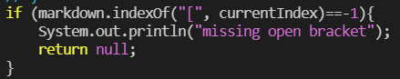
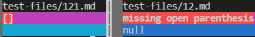
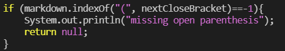

# Lab #5

Manually printing out the results of all 652 commonmark=spec tests will take hours on end of tedious work to thoroughly check the results of every test case. That is why we made a bash script to automatically run every test case for us. 

However, we only see the results for one of the markdown parse files. We can use another window to run bash for the other markdown parse file and manually compare the two from two separate windows; but there's actually an easier method. We'll be using `vimdiff`.

* Start by typing changing directories into the markdown file we first want to work in. In the command line `make` to initialize the file. 

* Next, type `bash script.sh > results.txt` to create a file called results that lists all the outputs for each test. Do this with both markdown parse files. 

* After that, we want to cd to the home directory and use the `vimdiff` command. To do so, we type in `vimdiff` followed by the file where the first folder is in, then add a `/`, then `results.txt`. Do the same for the second markdown parse file. An example command should look like the following:
`vimdiff newFolder/results.txt markdown-parse/results.txt`

Now we can compare both markdown parse results at the same time on one terminal. The column to the left is Joe's markdown parse. The one on the right is my markdown parse.

## First Test


I believe Joe's output is correct. The following is the code for this specific test:
```
<
 >
 ```
 There were no parenthesis or brackets thus, the default should simply be  `[]`. I believe my implementation is correct; however the output is not what we expected. It caught that this test file was missing brackets, which is what we wanted. But instead of returning `missing open parenthesis` and `null`, I would simply return the empty brackets. Here is a picture of my code that I would alter:



## Second Test


In this test, I believe that Joe's output is also correct. The following is the code for this specific test: 
```
foo
```
In this test, there were niether parenthesis or brackets again, which is why `[]` should be the result again. I think my implementation also correctly identifies the problem; however it isn't returning the output as we expected. In order to fix this, I would change the return statement from `missing open parenthesis` and `null` to `[]`. Here is a picture of my code that I would alter:
